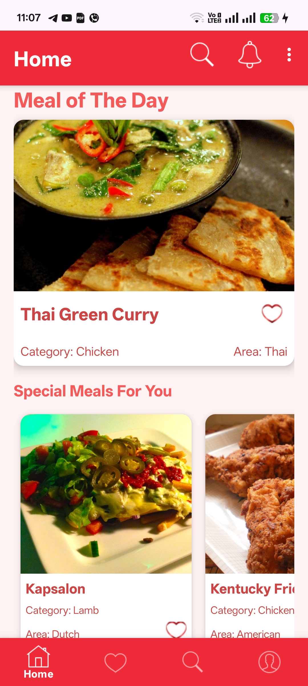
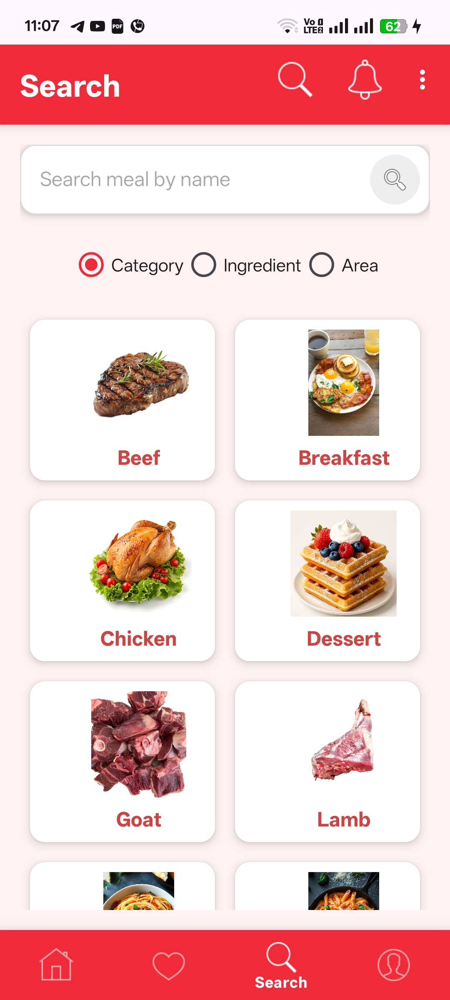
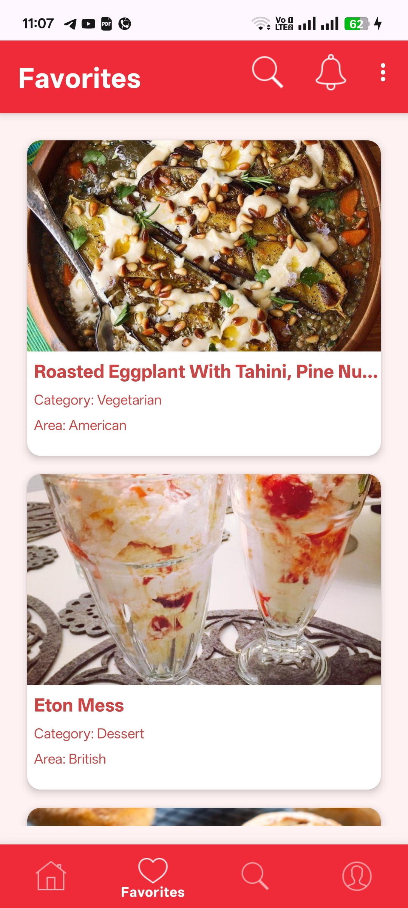
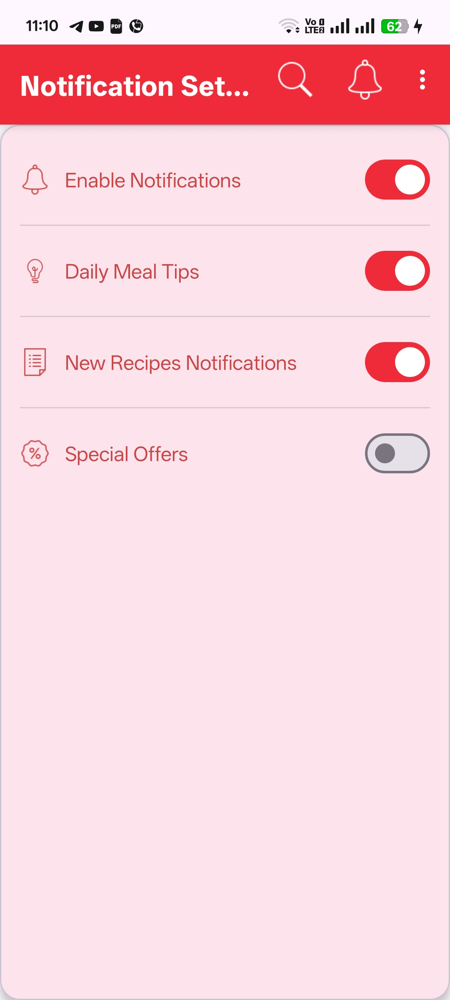
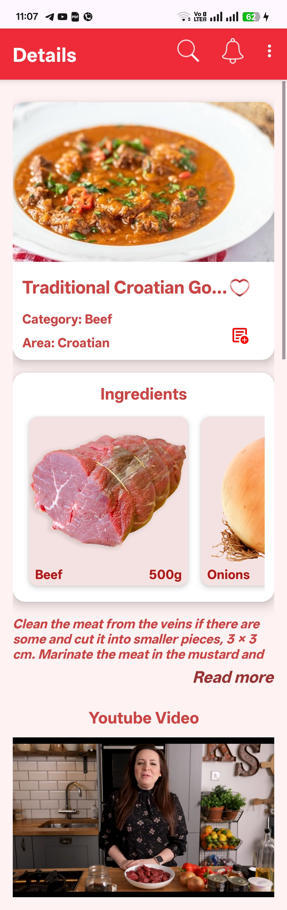
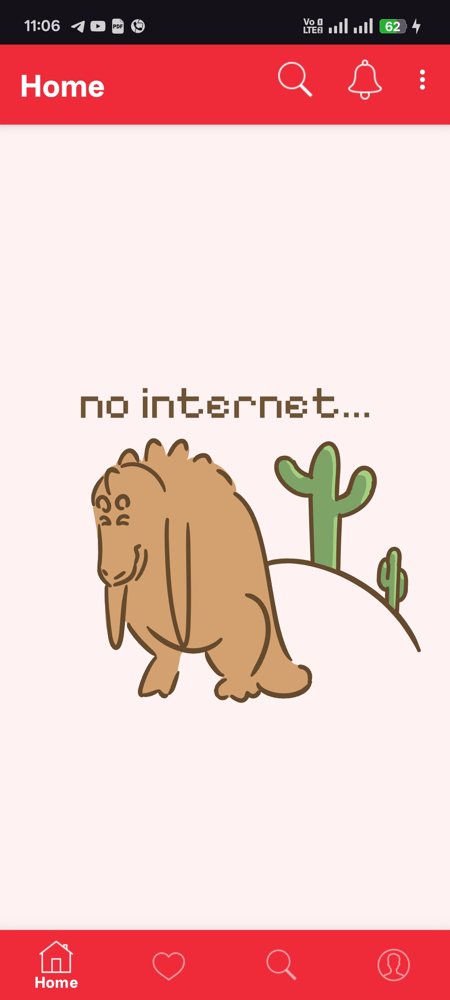
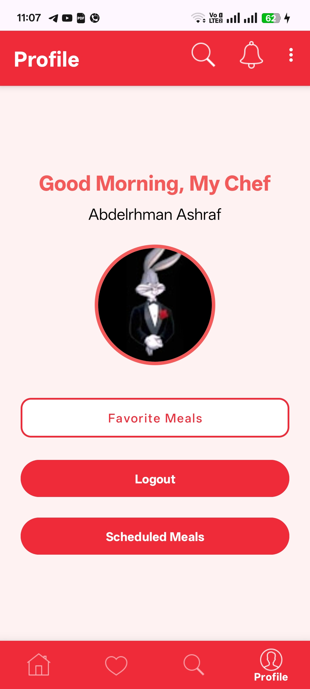
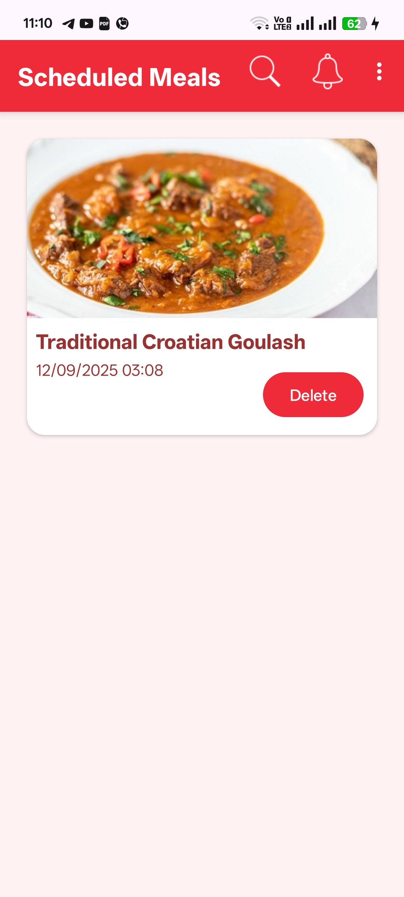
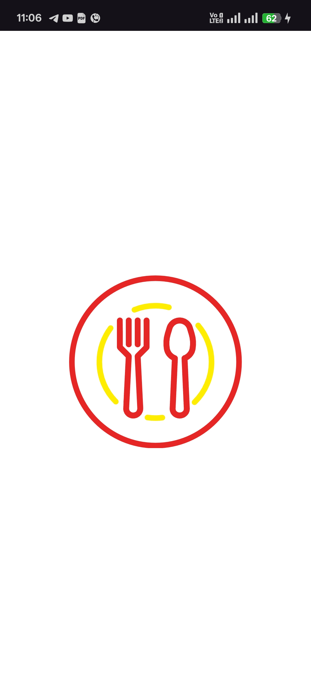

# 🍲 RecipeApp

An Android application for exploring, searching, and saving food recipes with user authentication and customizable notification settings.  

---

## ✨ Features
- 🔍 Search for recipes by name, ingredients, or category  
- 🏠 Home Feed with Recipes  
- ❤️ Save recipes to favorites (requires login)  
- 👤 User authentication (Email/Google) + Guest Mode  
- 🛎️ Notifications page with customizable options:  
  - General notifications  
  - Daily cooking tips  
  - New recipes  
  - Special offers  
- 📱 Modern UI using **Material Design** and **Bottom Navigation**  
- 📄 About screen  
- 📶 Offline Mode (browse favorite recipes without internet connection)  


---

## 🛠️ Tech Stack
- **Kotlin**  
- **XML layouts**  
- **Android Jetpack (Navigation, ViewModel, LiveData, WorkManager)**  
- **Firebase Authentication**  
- **Firebase Cloud Messaging (FCM)**  
- **Material Components**  

---

## 🚀 Getting Started
### Prerequisites
- Android Studio (latest version recommended)  
- Firebase project setup with Authentication and Cloud Messaging enabled  

### Installation
1. Clone the repository:
   ```bash
   git clone https://github.com/abdulrahmanAshraf1418/Recipe-App
   ```
2. Open the project in **Android Studio**  
3. Add your Firebase config file `google-services.json` inside the `app/` folder  
4. Sync Gradle and build the project  
5. Run it on an emulator or a physical device  

---

## 📸 Screenshots

| Home | Search | Favorites | Notifications |
|------|--------|-----------|----------------|
|  |  |  |  |

| Details | Offline | Profile | Scheduled |
|---------|---------|---------|-----------|
|  |  |  |  |

| Splash |
|--------|
|  |


---

## 📌 Notes
- In **Guest Mode**, some features (like saving to favorites) are disabled  
- You must configure your **Firebase project** for authentication and push notifications
- App requires internet connection for searching recipes
---

## 🔮 Future Work
- Add recipe categories and filters  
- Dark mode support  
- Offline access for saved recipes  
- Multi-language support  

---

## 🤝 Contributing
Contributions are welcome!  
1. Fork the repository  
2. Create a new branch (`feature/your-feature`)  
3. Commit your changes  
4. Push your branch  
5. Open a Pull Request  

---

## 👥 Contributors
- **[Abdulrahman Ashraf](https://github.com/abdulrahmanAshraf1418)  **
- **[Yousef Ashraf](https://github.com/Yousef-Ashraf01)**

---


## 📄 License
This project is for educational purposes. Feel free to use and modify it.  

---

## 👨‍💻 About Me
Developed by **Abdelrhman Ashraf**  
- 📧 Email: [abdulrahmanAshraf1418@gmail.com](mailto:abdulrahmanAshraf1418@gmail.com)
- 💼 LinkedIn: [Abdulrahman Ashraf](https://linkedin.com/in/abdulrahmanashraf1418)  
- 🐙 GitHub: [Abdulrahman Ashraf](https://github.com/abdulrahmanAshraf1418)  
